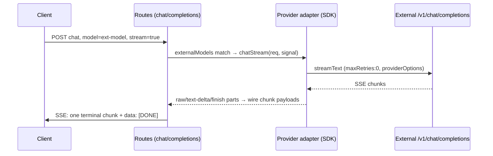

# multi-provider-pipelines — Design

## Context

`llm-proxy` currently serves only its managed `llama-server` backend through a
hand-rolled fetch+SSE provider. This change adds **external providers** (OpenAI,
Anthropic, local OpenAI-compatible servers) behind the existing
`Provider { name; chat(); chatStream() }` seam, using the `ai` SDK
(`@ai-sdk/openai-compatible` 3.x). External providers are declared in config as
`provider.*` entries, exposed as ordinary models in `/v1/models`, and callable
directly or as final nodes of chains. Inside scope: providers config, the
adapter, dependencies, error translation, model listing/404s, `${ENV}` secrets.
Frozen: the Provider seam, `graph-engine`, `buildStreamBody`, llama-server's
fetch path, dynamic per-call auth, OTel.

## Architecture decisions

| # | Decision | Rationale |
|---|----------|-----------|
| ADR-1 | Adapter implements the existing `Provider` seam; llama-server untouched. | Zero risk to the proven path; migration happens behind the seam. |
| ADR-2 | `maxRetries: 0` on every SDK call; SDK errors translated to `Error & { status }`. | Graph engine's `on_429` / `tool_calls_route` dispatch on `err.status`. |
| ADR-3 | Stream wire fidelity via `include: { rawChunks: true }`: `raw` parts pass through verbatim; `text-delta`/`tool-call`/`finish` synthesis only as fallback. | External tool-call deltas keep their upstream shape; contract tests pin the fallback. |
| ADR-4 | Wire `tools`/`tool_choice` travel via `providerOptions` (raw shape), not SDK `tool()` defs. | SDK `tool()` re-shapes args/JSON-schema; raw pass-through keeps byte fidelity. |
| ADR-5 | Static auth resolved from `${ENV}` at config load, fail-closed naming the variable. | Spec scenario: typed config carries resolved secret; unset var must fail loudly. |
| ADR-6 | Direct external routing before the llama passthrough/404 branch, via an `externalModels: Map<modelId, providerName>` registry (default empty). | Existing routes/tests untouched when no providers configured. |
| ADR-7 | Adapters built once at boot; rebuilt on dashboard apply-reload. | Cheap, side-effect-free construction; env key rotation via apply. |
| ADR-8 | No `noteActivity` for external providers. | No llama worker to protect from TTL/VRAM unload. |

## Config schema (`src/config/schema.ts`, `load.ts`)

```ts
const externalProviderSchema = z.object({
  baseURL: z.string().min(1),                 // required — missing → zod load error
  apiKey: z.string().optional(),
  headers: z.record(z.string()).optional(),
  models: z.array(z.string().min(1)),         // required list of exposed model ids
}).strict();                                   // unknown keys rejected

providers: z.record(externalProviderSchema).default({}),
```

`loadGatewayConfig` runs a post-parse pass interpolating `${VAR}` inside
`apiKey` and `headers` values from `process.env`; an unset variable throws
`Error("[config] providers.<name>.apiKey: env var VAR is not set")` and fails
boot. `defaults.ts` emits `providers: {}`.

## Adapter (`src/providers/openai-compatible.ts`)

- `makeOpenAICompatibleProvider(opts: { name; baseURL; apiKey?; headers?; models; }): Provider` — builds `createOpenAICompatible({ name, baseURL, apiKey, headers }).languageModel(modelId)` per call; injects nothing else (auth is static per ADR-5).
- `providerOptionsFrom(request, name)` — sampler pass-through: request fields already mapped by the schema (`temperature`, `top_p`, `max_tokens`, `stop`, `seed`, `presence_penalty`, `frequency_penalty`) become settings; every other key (`top_k`, `min_p`, `repetition_penalty`, `tools`, `tool_choice`, …) is spread raw under `providerOptions[name]` and merged into the body top-level by the SDK (camelCase provider key → body keys).
- `translateSDKError(err): Error & { status }` — see table.
- `toFinishReason(reason)` — `tool-calls→tool_calls`, `content-filter→content_filter`, `length→length`, else `stop`.

## Request → wire mapping

| Gateway field | Setting / body | Notes |
|---------------|----------------|-------|
| `messages` | SDK `messages` | Passed as OpenAI message shape; SDK normalizes parts internally. |
| `temperature`, `top_p` | `temperature`, `topP` | Reversed for top_p. |
| `max_tokens` | `maxOutputTokens` (v7) | |
| `stop` | `stopSequences` | |
| `stream` | adapter branch | stream → `chatStream`, else `chat`. |
| `tools`, `tool_choice` | `providerOptions[name]` | Raw wire shape (ADR-4). |
| `top_k`, `min_p`, … | `providerOptions[name]` | CamelCase key; valid for openai-compatible (`top_k` sampler). |

Non-stream `chat()` reconstructs the OpenAI envelope from
`generateText` result (`text`, `toolCalls`, `usage`, `finishReason`):
`tool_calls[i] = { id, type: "function", function: { name, arguments: JSON.stringify(args) } }` — then the route rewrites `id`/`model`/`created` exactly as the chain path does.

## Streaming

`streamText({ ..., maxRetries: 0, abortSignal, include: { rawChunks: true } })`; provider created with `includeUsage: true`. Part loop inside `chatStream`:

```text
raw          → yield JSON.stringify(part.data)          // verbatim chunk
text-delta   → yield synthesized content chunk          // fallback only
tool-call    → yield synthesized tool_calls chunk       // fallback only
finish       → yield terminal chunk (finish_reason + usage) if no raw finish seen
error        → throw translateSDKError(part.error)
abort        → return (clean stop; buildStreamBody writes [DONE])
```

`buildStreamBody` is reused unchanged for external streaming — its invariants
(exactly one terminal chunk, exactly one `[DONE]`, single error chunk) hold
because the adapter yields OpenAI-wire chunk payloads, exactly like llama-server.

## Errors → `Error & { status }`

| SDK error | status |
|-----------|--------|
| `TooManyRequestsError` | 429 |
| `APICallError` | `statusCode` (401/404/5xx…) |
| `NoSuchModelError` | 404 |
| `RetryError` / `StreamProviderError` | `statusCode` ?? 500 |
| other / abort mid-`chat()` | 500 / rethrow |

Message preserves the upstream text (statusText when available).

## Integration

Routing order in `chat.ts` / `completions.ts` (1 → 3, additive):

1. Chain dispatch (`gateway/*` or `X-Chain-ID`) — unchanged.
2. `externalModels.get(model)` → direct adapter path: non-stream → `provider.chat(body, model)` → JSON (model/id/created rewritten); stream → `buildStreamBody(provider, body, signal, newCompletionId(), created, model)` → SSE. Completions reuse the existing chat-payload conversion in both directions.
3. llama passthrough / 404 — `modelExists` extended with `externalModels`, 404 `model_not_found` otherwise. External dispatch happens before the `backendAvailable` gate.

`models.ts`: merged listing `[llama models, gateway/* chains, external models]`, external entries `{ id: modelId, object: "model", created, owned_by: providerName }` (no `meta`). `index.ts` boot builds `providers` (external adapters appended) and the `externalModels` map; apply-reload rebuilds both (ADR-7).



## Test plan

- **Adapter contract (no network, fake LanguageModelV4/parts)**: raw passthrough; fallback synthesis (text-delta/tool-call/finish → exact chunk JSON); terminal-chunk guarantee; error mapping per table; `maxRetries: 0` and `abortSignal` forwarded; providerOptions → camelCase body keys (`top_k`).
- **Config**: missing `baseURL`/`models` → load error; `.strict()` unknown key; empty default; `${ENV}` resolve + unset → error naming the variable.
- **Integration (in-process Bun.serve, mock wire server)**: direct external streaming (one terminal chunk + one `[DONE]`), non-streaming JSON, `/v1/models` listing, unknown model → 404 `model_not_found`, external final chain node via graph engine.
- Existing contract tests (`stream`, `graph-route`, `models`, `errors`, `graph-engine`) pass unchanged; full suite + `typecheck` + `lint`.

## Risks

| Sev | Risk | Mitigation |
|-----|------|-----------|
| Med | Raw-chunk shapes vary by upstream provider | Verbatim passthrough (ADR-3); contract tests pin fallback. |
| Med | Resolved secrets visible via `/api/ui/config` + apply round-trip persists them | Providers not dashboard-editable; documented; optional redaction hardening. |
| Med | `ai` adds ESM-only deps; zod peer forces manifest bump `^3.23.8→^3.25.76` | Lock already pins 3.25.76; verified Bun 1.4 ESM compatibility. |
| Low | `providerOptions` key collision (`tools`/`tool_choice`) | Reserved keys excluded from sampler spread; explicit wire pass-through. |
| Low | Unset `${ENV}` now fails boot for that provider | Fail-closed per spec; error names the variable. |